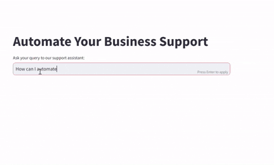

# AI Customer Support Bot
A QnA chatbot to answer customer queries on your website, ready-to-use with no need for API keys.

## Features 
- It is built locally and does not require any API keys.
- It uses Retrieval Augmented Generation technique to answer customer questions.
- It scrapes the content on your website as a context to answer the questions.
- It provides docker image to publish and run it on web.
- It also provides docker image to run the API to allow integration of bot to your own websites. 
- It uses Ollama as a local model server, chromdb as local vector db, and streamlit to host your application on web : all for free.

## Demo
I have used a sample website (after due permission from the website owner) to extract information and answer customer questions based on it. 

The sample webiste is: [Automate Your Business](https://www.automatebusiness.com/)  

## How to run

### Setup environment
1) Get Website URL and set environment variable BASE_URL.
2) 