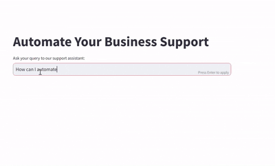
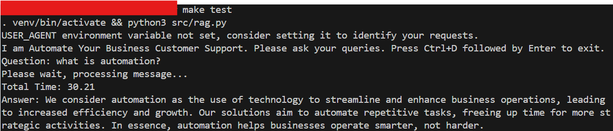
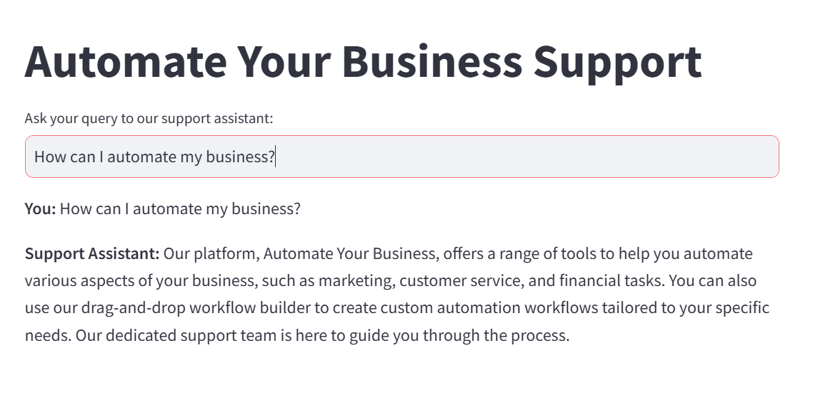
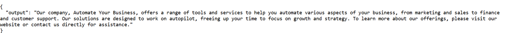

# AI Customer Support Bot
A QnA chatbot to answer customer queries on your website, ready-to-use with no need for API keys.

## Features 
- It is built locally and does not require any API keys.
- It uses Retrieval Augmented Generation technique to answer customer questions.
- It scrapes the content on your website as a context to answer the questions.
- It provides docker image to publish and run it on web.
- It also provides docker image to run the API to allow integration of bot to your own websites. 
- It uses Ollama as a local model server, chromdb as local vector db, and streamlit to host your application on web : all for free.

## Demo
I have used a sample website (after due permission from the website owner) to extract information and answer customer questions based on it. 

The sample website is: [Automate Your Business](https://www.automatebusiness.com/)  
The demo shows streamlit app to answer customer questions based on website content.

## How to run

### Setup environment
1) Get Website URL and set environment variable BASE_URL in Makefile.  
   `export BASE_URL="<insert-your-website-url-here>"`
   
3) Setup Ollama to run LLMs locally.

   - [Download](https://ollama.com/download) and run the the Ollama app.
   - Fetch the required models (a general purpose model and a text embedding model) from the command line.
      ```
        ollama pull llama3.1:8b
        ollama pull nomic-embed-text
      ```
   - Set environment variable OLLAMA_BASE_URL in Makefile. By default, all models are automatically served on localhost:11434.  
    `export OLLAMA_BASE_URL="http://127.0.0.1:11434"`  
    
3) Setup chromadb for storing vector embeddings locally. We will use the official docker image for [chromadb](https://hub.docker.com/r/chromadb/chroma).
     ```
     docker pull chromadb/chroma
     docker run chromadb/chroma
     ```
     This will host the chromadb, by default, on localhost:8000. Now set the environment variable CHROMA_HOST to point to this URL.  
     `export CHROMA_HOST="http://127.0.0.1:8000"`  
      Note: The CHROMA_HOST and OLLAMA_BASE_URL variables provide flexibility to use a different server machine to host your models and db. This can be utilized in case 
      there is   a different more powerful server available to host these services and descrese processing time.

### Run the code
The Makefile provides all the commands needed to run the code.

1) Setup local python environment to run the code and install required libraries.  
   `make setup`  
   Run this only first time when setting up the environment.  
   
2) Convert the website content into embeddings and store in vector db for retreival later.  
   `make ingest`  
   This runs our web ingester which:
   - gets all sub URLs from provided BASE_URL of website
   - use embedding model from Ollama to convert the website content into embeddings
   - store these embeddings as a vector store in chromadb
   - returns ingestion_logs.txt showing which sub URLs were ingested from website.
  
3) Run the QA tool in terminal to test the RAG (retreival Augmented Generation) based on ingested embeddings.  
    `make test`  
    This will run the QA tool in terminal to allow testing.
      

4) Run the streamlit web app to use the tool in web.  
   `make run`  
   This will run your app on http://localhost:8501/
     

5) Run the streamlit app as a docker image.
   ```
   docker build -t streamlit .
   docker run -p 8501:8501 streamlit
   ```
   This will run the docker image and host your web app.
   
7) Run the api for your QA bot.  
   `make api`  
   This will serve by flask app to run the api on http://127.0.0.1:5000    
   To test the api, GET the invoke request in browser with question as a parameter:  
   http://localhost:5000/invoke?question=How%20can%20I%20automate%20my%20Business  
     

9) Run the api as a docker image.
    ```
   docker build -t api .
   docker run -p 5000:5000 api
   ```
    This will run the api docker image and host your api to be used in your internal code.  
